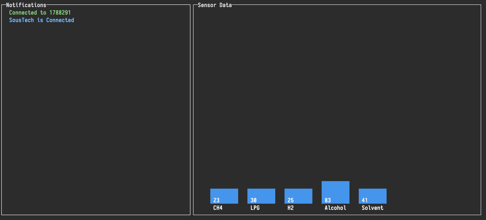
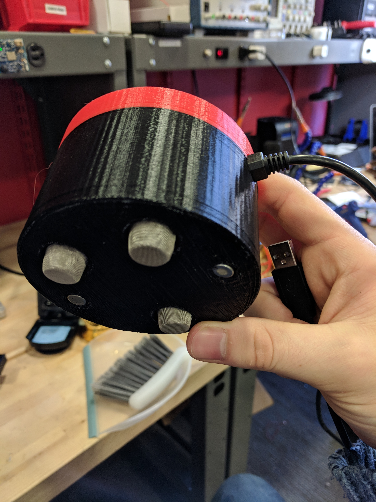

# SousTech Update 2
#### Zachary Wade &lt;zwade&gt;

## Major Changes

No major changes have occured yet.

## Accomplishments

Over the past two weeks I have designed and refined the physical model for the SousTech prototype. In addition, I made a few more changes to the hardware to provide more accurate data, and to remove some flaky connections. After these changes, I have found the prototype to be robust and not prone to false reading. In addition to working on the 3D enclosure, I have also nearly finished writing the software to allow me to capture, store, and analyze data samples from testing. A screenshot of this design can be found here

In addition, here is a look at the latest version of the hardware prototype

## Milestone

The plan for this milestone was to design the enclosure as well as develop a set of tests. While I have made strong progress with the enclosure, I have not yet developed any tests, as I forgot that I first need a way to interact with the device in a consistent manner. Thus, instead of developing an array of tests, I have been working on this interface pictured above. As such, for the next milestone I hope to have both of these finished, tests developed, and with any luck, some data from actual tests.

## Suprises

There were some mild issues with the printing of the enclosure, including limited lab access, printer running out of plastic, and the printer jamming. While these were frustrating delays, they are, to some extent, expected.

## Looking Ahead

Looking ahead I will be finishing up both the hardware and software for the prototype, and focusing on how data collection should proceed. In addition, I need to ensure that I have appropriate regression models for analyzing the data.

## Revisions

The general idea behind this and the previous milestone will stay the same, although I will need to push it back a little bit as I finish up the things mentioned above. No drastic changes, however, are required.

## Resources

No further resources are needed at this time
