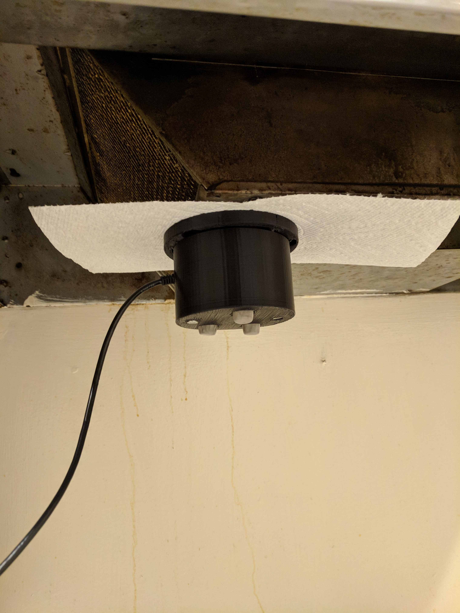
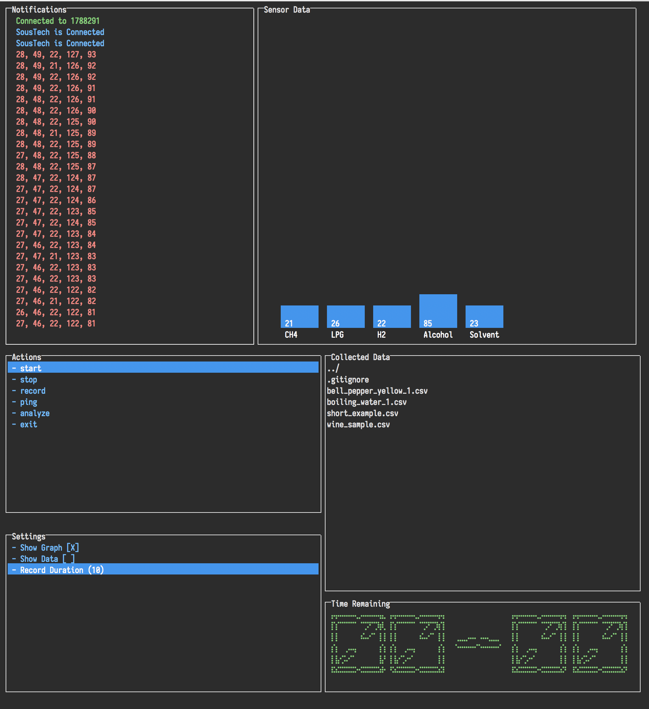

# SousTech Update 3
#### Zachary Wade &lt;zwade&gt;

## Major Changes

No major changes have occured yet.

## Accomplishments

While I lost a week due to a competition in Japan, there have been a number of exciting changes since the last milestone report. The first of these, is that the hardware protopype is complete, and is so far holding up very well. In addition, the data collection interface has matured greatly, and now has additional visualization and capture management options. With these two completed, I have also been able to start collecting data in an attempt to understand how to callibrate the device. Below is a picture of the installed device.

As well as the improved interface

## Milestone

For this milestone, the hope was to have completed hardware and software, which I have successfully completed. In addition, I had aspired to having a rouch idea for testing layed out. While this is the case, the testing I am doing right now is of a slightly different nature, as this is exploratory in the hopes of understanding the sensors better, and how to optimally calibrate them.

## Suprises

My only major surprise was how well the new enclosre worked. It was a pretty clever design, and I am quite proud of it.

## Looking Ahead

Hopefully, calibration will not take more than a week to complete, so once I have finished calibrating the sensors, I will be able to collect meaningful data. I should be well into this by next week.

## Revisions

Due to the competition, and the previous week's delays, I am still following my planned milestones roughly, albeit at a mild delay. Thus, no major revisions are necessary.

## Resources

I will need further food to test with as I progress, although I have a plan for acquiring these.

